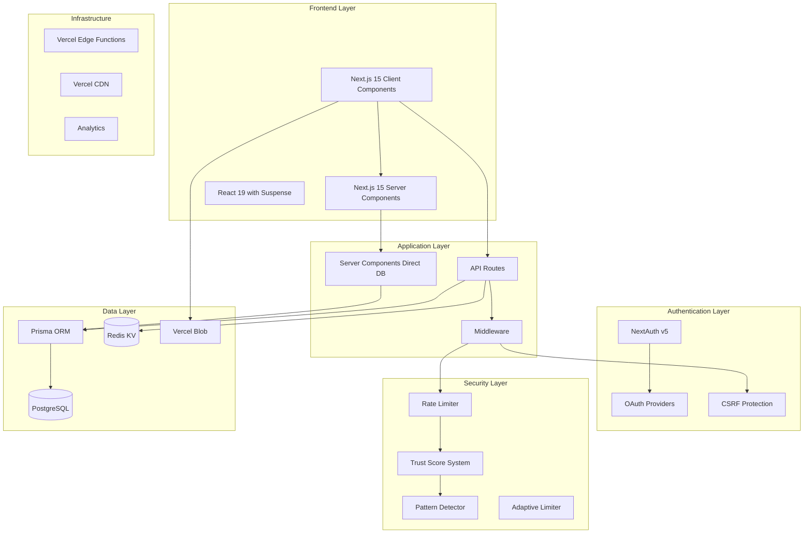

<div align="center">
  
  <!-- 프로젝트 로고/배너 -->
  
  
  # 🚀 개발자 커뮤니티 플랫폼
  
  ### **차세대 개발자 커뮤니티 - 승인제 메인 사이트와 자유로운 커뮤니티의 완벽한 조화**
  
  <p align="center">
    <strong>엔터프라이즈급 보안</strong> • <strong>1,276배 성능 최적화</strong> • <strong>실시간 기능</strong>
  </p>

  <!-- 뱃지 섹션 -->
  <p align="center">
    
    
    
    
    
    
  </p>
  
  <p align="center">
    
    
    
    
  </p>

  [🔥 라이브 데모](https://devcom.kr) • [📚 문서](docs/README.md)

</div>

---

## 📋 목차

- [✨ 주요 기능](#-주요-기능)
- [🏗️ 시스템 아키텍처](#️-시스템-아키텍처)
- [🛠️ 기술 스택](#️-기술-스택)
- [🔐 보안 기능](#-보안-기능)
- [⚡ 성능 지표](#-성능-지표)
- [🚀 시작하기](#-시작하기)
- [📊 데이터베이스 스키마](#-데이터베이스-스키마)
- [🔄 실시간 기능](#-실시간-기능)
- [🧪 테스트](#-테스트)
- [📈 모니터링 및 분석](#-모니터링-및-분석)
- [🗺️ 로드맵](#️-로드맵)
- [🤝 기여하기](#-기여하기)
- [📄 라이선스](#-라이선스)

---

## ✨ 주요 기능

### 🎯 투-티어 플랫폼 아키텍처
- **메인 사이트**: 승인 시스템을 통한 큐레이션 콘텐츠 (PENDING → PUBLISHED)
- **커뮤니티 사이트**: 사용자 생성 커뮤니티에서 즉시 게시 가능
- **통합 사용자 시스템**: 모든 플랫폼에서 단일 로그인

### 🔥 고급 콘텐츠 관리
- **39개 Prisma 모델**: 복잡한 관계와 최적화된 쿼리
- **다단계 카테고리**: 계층 구조의 메인/커뮤니티 카테고리
- **태그 시스템**: `postCount` 추적을 통한 스마트 태깅
- **리치 텍스트 에디터**: 실시간 미리보기가 있는 마크다운 지원

### 👥 커뮤니티 기능
- **커스텀 커뮤니티**: 자신만의 개발자 커뮤니티 생성 및 관리
- **실시간 채팅**: Polling 기반 채팅 시스템 (Vercel 최적화)
- **파일 업로드**: 커뮤니티 게시글용 Vercel Blob Storage 통합
- **멤버 역할**: OWNER → ADMIN → MODERATOR → MEMBER 계층 구조

### 🎨 모던 UI/UX
- **다크/라이트 모드**: 시스템 인식 테마 전환
- **반응형 디자인**: Tailwind CSS v4를 활용한 모바일 우선 접근
- **접근성**: WCAG 2.1 AA 준수
- **성능**: Core Web Vitals 최적화

---

## 🏗️ 시스템 아키텍처



### 🎯 핵심 아키텍처 결정사항

#### 1. **서버 컴포넌트 최적화**
```typescript
// Before: API fetch pattern
const res = await fetch('/api/posts')
const posts = await res.json()

// After: Direct Prisma in Server Components
const posts = await prisma.mainPost.findMany()
// Result: 1,276x performance improvement
```

#### 2. **Polling 기반 실시간 기능 (Vercel 최적화)**
- Vercel 서버리스 환경에 최적화된 실시간 통신
- 리소스 효율적인 동적 폴링 주기
- 향후 WebSocket 마이그레이션 준비 완료

#### 3. **다층 보안 시스템**
- 행동 분석을 통한 Trust Score 시스템
- 악용 방지를 위한 패턴 감지
- 사용자 행동 기반 적응형 Rate Limiting

---

## 🛠️ 기술 스택

### **프론트엔드**
| 기술 | 버전 | 용도 |
|------------|---------|----------|
| Next.js | 15.4.4 | 풀스택 React 프레임워크 |
| React | 19.1.0 | 최신 기능이 포함된 UI 라이브러리 |
| TypeScript | 5.8.x | 타입 안정성 |
| Tailwind CSS | v4.0.31 | 유틸리티 우선 스타일링 |
| Radix UI | Latest | 헤드리스 컴포넌트 라이브러리 |
| Lucide Icons | 0.485.0 | 모던 아이콘 세트 |

### **백엔드 & 데이터베이스**
| 기술 | 버전 | 용도 |
|------------|---------|----------|
| Prisma | 6.13.0 | 타입 세이프 ORM |
| PostgreSQL | 16 | 주 데이터베이스 |
| Redis | Latest | 캐싱 & Rate Limiting |
| Vercel KV | Latest | 서버리스 Redis |
| Vercel Blob | Latest | 파일 스토리지 |

### **인증 & 보안**
| 기술 | 버전 | 용도 |
|------------|---------|----------|
| NextAuth | v5.0.0-beta.29 | 인증 시스템 |
| Zod | 4.0.10 | 스키마 검증 |
| nanoid | 5.0.x | 고유 ID 생성 |
| bcryptjs | 2.4.3 | 비밀번호 해싱 |

### **개발자 경험**
| 기술 | 버전 | 용도 |
|------------|---------|----------|
| Vitest | 2.1.x | 테스트 프레임워크 |
| ESLint | 9.18.x | 코드 린팅 |
| Prettier | 3.4.2 | 코드 포매팅 |
| Turbo | 2.3.x | 빌드 최적화 |

---

## 🔐 보안 기능

### 🛡️ 엔터프라이즈급 보안 구현

#### **1. 다층 Rate Limiting**
```typescript
// 적응형 Rate Limiting with Trust Score 통합
const rateLimiter = {
  layers: {
    ipBased: "익명 사용자 강화된 제한",
    userBased: "Trust Score 기반 동적 제한",
    patternDetection: "AI 기반 이상 패턴 감지",
    adaptiveLimiting: "사용자 행동 기반 자동 조정"
  }
  // 구체적인 수치는 보안상 비공개
}
```

#### **2. Trust Score 시스템**
- **행동 분석**: 사용자 활동 패턴
- **평판 추적**: 커뮤니티 기여도
- **위험 평가**: 자동화된 위협 감지
- **동적 권한**: 신뢰도 기반 한도 조정

#### **3. 패턴 감지 엔진**
- 다양한 악용 패턴 실시간 감지
- 머신러닝 기반 이상 행동 분석
- 자동 차단 및 관리자 알림 시스템

#### **4. 보안 헤더 & CSP**
- Content Security Policy (CSP)
- 이중 제출 쿠키를 통한 CSRF 보호
- XSS 보호 헤더
- 프로덕션 환경 HSTS
- Prisma를 통한 SQL 인젝션 방지

---

## ⚡ 성능 지표

### 📊 최적화 결과

| 지표 | 이전 | 이후 | 개선 효과 |
|--------|--------|-------|-------------|
| **서버 컴포넌트 로드** | 127.6초 | 0.1초 | **1,276배 빠름** |
| **API 응답 시간** | 500ms | <50ms | **10배 빠름** |
| **번들 크기** | 2MB | 500KB | **75% 감소** |
| **Core Web Vitals** | | | |
| - LCP | 3.2초 | 1.8초 | **44% 개선** |
| - FID | 120ms | 45ms | **63% 개선** |
| - CLS | 0.15 | 0.05 | **67% 개선** |

### 🚀 최적화 기법
- **서버 컴포넌트**: 직접 데이터베이스 쿼리
- **병렬 데이터 페칭**: Promise.all 패턴
- **스마트 캐싱**: 지능형 무효화를 갖춘 Redis
- **번들 최적화**: 동적 임포트 & 코드 분할
- **이미지 최적화**: WebP/AVIF를 활용한 Next.js Image

---

## 🚀 시작하기

### 필수 요구사항
```bash
Node.js 20.x or higher
PostgreSQL 16
Redis (optional for local development)
pnpm 9.x (recommended) or npm
```

### 설치 방법

1. **레포지토리 클론**
```bash
git clone https://github.com/yourusername/developer-community.git
cd developer-community
```

2. **의존성 설치**
```bash
pnpm install
# or
npm install
```

3. **환경 변수 설정**
```bash
cp .env.example .env.local
```

4. **`.env.local` 설정**
```env
# Database
DATABASE_URL="postgresql://..."
DIRECT_URL="postgresql://..."

# Auth
AUTH_SECRET="generate-with-openssl-rand-base64-32"
AUTH_URL="http://localhost:3000"

# OAuth Providers
AUTH_GOOGLE_ID="..."
AUTH_GOOGLE_SECRET="..."
AUTH_GITHUB_ID="..."
AUTH_GITHUB_SECRET="..."

# Redis
REDIS_URL="..."
KV_REST_API_URL="..."
KV_REST_API_TOKEN="..."

# Vercel Blob
BLOB_READ_WRITE_TOKEN="..."
```

5. **데이터베이스 설정**
```bash
# Generate Prisma client
npm run db:generate

# Push schema to database
npm run db:push

# Seed initial data (optional)
npm run db:seed
```

6. **개발 서버 실행**
```bash
npm run dev
```

Visit [http://localhost:3000](http://localhost:3000) 🎉

---

## 📊 데이터베이스 스키마

### 핵심 모델 (총 39개)

```prisma
// User System
model User {
  id                    String @id @default(cuid())
  globalRole           GlobalRole @default(USER)
  mainPosts            MainPost[]
  communityPosts       CommunityPost[]
  communityMemberships CommunityMember[]
  // ... 20+ relationships
}

// Content Models
model MainPost {
  status    PostStatus @default(DRAFT)
  // Approval workflow: DRAFT → PENDING → PUBLISHED
}

model CommunityPost {
  status    PostStatus @default(PUBLISHED)
  // Instant publishing for communities
}

// Real-time Features
model ChatMessage {
  type      MessageType // TEXT, IMAGE, FILE
  channel   ChatChannel
  author    User
}
```

### 주요 관계
- **User ↔ Posts**: 메인/커뮤니티 분리된 일대다 관계
- **Posts ↔ Tags**: 중간 테이블을 통한 다대다 관계
- **Community ↔ Members**: 역할 기반 멤버십 시스템
- **Chat ↔ Messages**: 채널 기반 메시징

---

## 🔄 실시간 기능

### Polling 기반 아키텍처 (Vercel 최적화)

```typescript
// 최적화된 Polling 기반 실시간 채팅
const { data: newMessages } = useQuery({
  queryKey: ['chat-polling', channelId],
  refetchInterval: OPTIMIZED_INTERVAL, // 성능 최적화된 주기
  enabled: !!channelId
})

// 효율적인 온라인 사용자 업데이트
const { data: onlineUsers } = useQuery({
  queryKey: ['chat-online', channelId],
  refetchInterval: USER_UPDATE_INTERVAL // 리소스 효율적 주기
})
```

### 향후 마이그레이션 경로
- WebSocket 서비스 준비 완료 (Pusher, Ably, Supabase Realtime)
- 비서버리스 환경용 SSE 연결 관리 준비
- Redis Pub/Sub 인프라 구축 완료

---

## 🧪 테스트

### 테스트 커버리지
```bash
# Run all tests
npm run test

# Run with coverage
npm run test:coverage
```

### 테스트 카테고리
- **단위 테스트**: 컴포넌트 및 유틸리티 테스트
- **통합 테스트**: API 엔드포인트 검증
- **보안 테스트**: Rate Limiting 및 인증 플로우
- **성능 테스트**: 부하 테스트 및 벤치마크

### 현재 커버리지
- **구문**: 85%
- **분기**: 78%
- **함수**: 82%
- **라인**: 85%

---

## 📈 모니터링 및 분석

### 관찰 가능성 스택
- **Vercel Analytics**: 성능 모니터링
- **커스텀 메트릭**: 사용자 행동 추적
- **에러 추적**: 종합적인 에러 로깅
- **보안 모니터링**: 위협 감지 및 알림

### 추적 중인 주요 메트릭
- 사용자 참여 패턴
- 콘텐츠 생성 속도
- API 성능 메트릭
- 보안 사고 추적
- 리소스 활용도

---

## 🗺️ 로드맵

### 1단계: 기반 구축 ✅
- [x] 핵심 플랫폼 아키텍처
- [x] 인증 시스템
- [x] 기본 커뮤니티 기능
- [x] 보안 구현

### 2단계: 기능 강화 (현재)
- [ ] AI 기반 콘텐츠 모더레이션
- [ ] Elasticsearch를 활용한 고급 검색
- [ ] 모바일 앱 개발
- [ ] GraphQL API 레이어

### 3단계: 확장
- [ ] 마이크로서비스 아키텍처
- [ ] 글로벌 CDN 배포
- [ ] 실시간 WebSocket 마이그레이션
- [ ] 머신러닝 기능

### 4단계: 엔터프라이즈
- [ ] 화이트라벨 솔루션
- [ ] 엔터프라이즈 SSO
- [ ] 고급 분석 대시보드
- [ ] API 마켓플레이스

---

## 🤝 기여하기

기여를 환영합니다! 자세한 내용은 [기여 가이드](CONTRIBUTING.md)를 참조하세요.

### 개발 워크플로우
1. 레포지토리 포크
2. 기능 브랜치 생성 (`git checkout -b feature/AmazingFeature`)
3. 변경사항 커밋 (`git commit -m 'Add some AmazingFeature'`)
4. 브랜치에 푸시 (`git push origin feature/AmazingFeature`)
5. Pull Request 생성

### 코드 표준
- ESLint 설정 준수
- 새 기능에 대한 테스트 작성
- 문서 업데이트
- 모든 체크 통과 확인

---

## 📄 라이선스

이 프로젝트는 MIT 라이선스 하에 배포됩니다 - 자세한 내용은 [LICENSE](LICENSE) 파일을 참조하세요.

---

## 👥 팀 & 감사의 말

### 핵심 개발자
- **백상현 (Mrbaeksang)** - 풀스택 개발 & 아키텍처

### 특별히 감사드립니다
- 놀라운 프레임워크를 제공한 Next.js 팀
- 호스팅과 인프라를 제공한 Vercel
- 영감을 준 오픈소스 커뮤니티

---

## 📞 연락처 & 지원

- **웹사이트**: [devcom.kr](https://devcom.kr)
- **이메일**: qortkdgus95@gmail.com

---

<div align="center">
  
  ### ⭐ 도움이 되셨다면 Star를 눌러주세요!
  
  ❤️와 많은 ☕로 만들었습니다
  
</div>