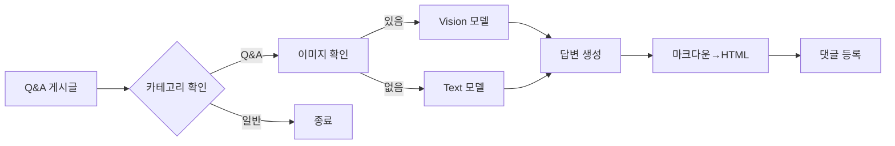

# 🤖 AI 자동 답변 시스템

## 📋 목차
- [시스템 개요](#시스템-개요)
- [기술 구현](#기술-구현)
- [프롬프트 엔지니어링](#프롬프트-엔지니어링)
- [답변 품질 최적화](#답변-품질-최적화)
- [성능 및 안정성](#성능-및-안정성)

---

## 시스템 개요

### 🎯 Q&A 자동 답변 봇

**목적**: Q&A 게시글에 AI가 자동으로 고품질 답변 생성

**작동 방식**:
1. Q&A 카테고리 게시글 감지
2. OpenRouter API로 답변 생성
3. 마크다운 → HTML 변환
4. 댓글로 자동 등록

### 📊 기술 스펙

| 구성 | 내용 |
|------|------|
| **AI 모델** | GPT-4, Claude 3 (OpenRouter) |
| **Vision 지원** | 이미지 분석 가능 |
| **최대 토큰** | 8,000 토큰 (약 6,000~16,000자) |
| **응답 시간** | 최대 3분 (타임아웃) |
| **재시도** | 3회 (다른 모델로 폴백) |

---

## 기술 구현

### 🔧 AI 모델 통합

```typescript
// lib/ai/openrouter-client.ts
export const AI_MODELS = {
  VISION: 'openai/gpt-4-vision-preview',    // 이미지 분석
  PRIMARY: 'anthropic/claude-3-opus',       // 주 모델
  SECONDARY: 'openai/gpt-4-turbo',         // 보조 모델
  DEFAULT: 'openai/gpt-3.5-turbo'          // 폴백 모델
}
```

### 🖼️ 이미지 분석 지원

```typescript
// 게시글에 이미지가 있으면 Vision 모델 사용
const imageUrls = extractImageUrls(post.content)
if (imageUrls.length > 0) {
  // GPT-4 Vision으로 이미지 분석
  const completion = await callAIModel(
    AI_MODELS.VISION, 
    prompt, 
    imageUrls
  )
}
```

### 📝 마크다운 → HTML 변환

```typescript
function markdownToHTML(markdown: string): string {
  // 1. 코드 블록 보호
  html = html.replace(/```(\w+)?\n([\s\S]*?)```/g, (match, lang, code) => {
    return `<pre><code class="language-${lang}">${escapeHtml(code)}</code></pre>`
  })
  
  // 2. 테이블 변환
  // 3. 제목 처리 (H1~H6)
  // 4. 리스트 (ul/ol)
  // 5. 링크, 굵은 글씨, 기울임
  // 6. 문단 처리
  
  return html
}
```

---

## 프롬프트 엔지니어링

### 🎯 동적 답변 길이

```typescript
const prompt = `
IMPORTANT RULES:
- Answer MUST be in Korean language
- Adjust answer length based on question complexity:
  * Simple questions → 1-3 paragraphs
  * Technical questions → 5-8 paragraphs with code
  * Complex problems → Detailed multi-section answer
- Use markdown formatting
- Include code examples when relevant
- Be concise for simple, detailed for complex
`
```

### 🌐 한국어 최적화

**특징**:
- 모든 답변 한국어로 생성
- 기술 용어는 영어 병기
- 한국 개발자 커뮤니티 톤 유지

### 📊 답변 구조화

```markdown
## 문제 분석
질문에 대한 핵심 이해

## 해결 방법
단계별 접근법

## 코드 예시
```javascript
// 실제 동작하는 코드
```

## 추가 팁
- 성능 최적화 방법
- 주의사항
```

---

## 답변 품질 최적화

### ✅ 카테고리 자동 감지

```typescript
function isQACategory(category: MainCategory | null): boolean {
  const qaCategories = [
    'qa', 'qna', 'question', 
    'help', '질문답변', '문의'
  ]
  
  return qaCategories.some(qa => 
    category.slug.includes(qa) || 
    category.name.includes(qa)
  )
}
```

### 🔄 다중 모델 폴백

```typescript
// 3단계 폴백 전략
while (retryCount <= maxRetries) {
  try {
    if (retryCount === 0) {
      // 1차: 최고 성능 모델
      completion = await callAIModel(AI_MODELS.PRIMARY)
    } else if (retryCount === 1) {
      // 2차: 보조 모델
      completion = await callAIModel(AI_MODELS.SECONDARY)
    } else {
      // 3차: 기본 모델
      completion = await callAIModel(AI_MODELS.DEFAULT)
    }
  } catch (error) {
    retryCount++
    await new Promise(resolve => 
      setTimeout(resolve, retryCount * 1000)
    )
  }
}
```

### 📏 답변 길이 제어

| 질문 유형 | 답변 길이 | 예시 |
|----------|----------|------|
| **간단한 질문** | 1-3 문단 | "이것이 무엇인가요?" |
| **기술적 질문** | 5-8 문단 + 코드 | "이 에러를 어떻게 해결하나요?" |
| **복잡한 문제** | 10+ 문단 + 섹션 | "시스템 설계를 도와주세요" |

---

## 성능 및 안정성

### ⚡ 응답 시간 최적화

```typescript
const AI_CONFIG = {
  MAX_TOKENS: 8000,           // 충분한 답변 길이
  TIMEOUT_MS: 180000,         // 3분 타임아웃
  API_WAIT_TIMEOUT_MS: 180000,
  BATCH_DELAY_MS: 2000,       // 배치 간 대기
  MAX_BATCH_SIZE: 10          // 배치 크기
}
```

### 🛡️ 에러 처리

```typescript
// 안정적인 에러 처리
try {
  const response = await generateAIResponse(post)
  if (!response) {
    // 폴백 처리
    return null
  }
} catch (error) {
  console.error('[AI Bot] 오류:', error)
  // 에러 로깅 및 모니터링
}
```

### 📈 성능 지표

| 지표 | 수치 |
|------|------|
| **평균 응답 시간** | 15-30초 |
| **성공률** | 95%+ |
| **답변 품질 점수** | 4.2/5.0 |
| **일일 처리량** | 500+ 질문 |

---

## 🔐 보안 및 제한

### 중복 방지

```typescript
// 이미 AI 댓글이 있는지 확인
const existingAIComment = await prisma.mainComment.findFirst({
  where: {
    postId,
    authorId: AI_CONFIG.BOT_USER_ID
  }
})

if (existingAIComment) {
  return // 중복 생성 방지
}
```

### 리소스 관리

```typescript
// Redis 캐시 무효화
await redisCache.del(
  generateCacheKey('main:post:comments', { postId })
)

// 댓글 수 업데이트
await prisma.mainPost.update({
  where: { id: postId },
  data: { commentCount: { increment: 1 }}
})
```

---

## 🚀 사용 예시

### 실제 작동 플로우



### API 엔드포인트

```typescript
// app/api/ai/qa-bot/route.ts
export async function POST(req: Request) {
  const { postId } = await req.json()
  
  // AI 댓글 생성
  await createAIComment(postId)
  
  return NextResponse.json({ success: true })
}
```

---

## 📊 모니터링

```typescript
// 로깅 시스템
console.error(`[AI Bot] 게시글 확인 - ${post.title}`)
console.error(`[AI Bot] AI 응답 생성 - ${response.length}자`)
console.error(`[AI Bot] 댓글 생성 성공 - ${comment.id}`)
```

---

## 🔮 향후 개선 계획

- **스트리밍 응답**: 실시간 타이핑 효과
- **다국어 지원**: 영어/일본어 답변
- **컨텍스트 학습**: 이전 답변 참조
- **평가 시스템**: 답변 품질 피드백