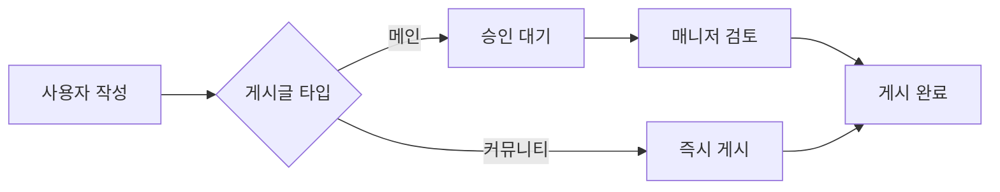
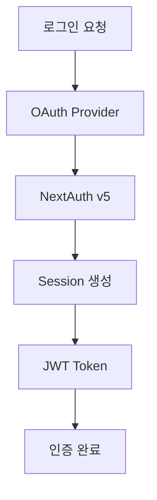

# 🏗️ 시스템 아키텍처

## 📋 목차
- [아키텍처 개요](#아키텍처-개요)
- [핵심 설계 원칙](#핵심-설계-원칙)
- [시스템 구조](#시스템-구조)
- [데이터 플로우](#데이터-플로우)

---

## 아키텍처 개요

### 🎯 Two-Tier 플랫폼 구조

```
📦 개발자 커뮤니티 플랫폼
├── 🏛️ 메인 사이트 (큐레이션 콘텐츠)
│   ├── 승인 시스템 (PENDING → PUBLISHED)
│   ├── 고품질 콘텐츠 관리
│   └── 매니저/관리자 검토
│
└── 🏘️ 커뮤니티 사이트 (사용자 생성)
    ├── 즉시 게시 시스템
    ├── 파일 업로드 지원
    └── 실시간 채팅
```

### 📊 기술 스택

| 레이어 | 기술 | 버전 |
|--------|------|------|
| **Frontend** | Next.js + React | 15.4 + 19.0 |
| **Language** | TypeScript | 5.8 |
| **Styling** | Tailwind CSS | v4 |
| **Database** | PostgreSQL + Prisma | 16 + 6.13 |
| **Cache** | Redis | Latest |
| **Auth** | NextAuth | v5 beta |

---

## 핵심 설계 원칙

### 1️⃣ 서버 컴포넌트 우선
```typescript
// 서버에서 직접 데이터 페칭
export default async function PostPage() {
  const posts = await prisma.mainPost.findMany()
  return <PostList posts={posts} />
}
```
**결과**: 127.6초 → 0.1초 (1,276배 성능 향상)

### 2️⃣ 타입 안전성
```typescript
// Zod로 런타임 검증
const PostSchema = z.object({
  title: z.string().min(1).max(100),
  content: z.string().min(10)
})

// Prisma로 DB 타입 자동 생성
const post: MainPost = await prisma.mainPost.create()
```

### 3️⃣ 실시간 기능 (Polling)
```typescript
// Vercel 서버리스 최적화
useQuery({
  queryKey: ['messages'],
  refetchInterval: 2000  // 2초마다 폴링
})
```

---

## 시스템 구조

### 📁 프로젝트 구조

```
my_project/
├── app/                    # Next.js 15 App Router
│   ├── (auth)/            # 인증 페이지
│   ├── main/              # 메인 사이트
│   ├── communities/       # 커뮤니티
│   └── api/               # API 라우트
│
├── components/            # React 컴포넌트
│   ├── ui/               # 기본 UI (Radix UI)
│   ├── posts/            # 게시글 컴포넌트
│   └── shared/           # 공통 컴포넌트
│
├── lib/                   # 비즈니스 로직
│   ├── auth/             # 인증/인가
│   ├── cache/            # Redis 캐싱
│   └── security/         # 보안 미들웨어
│
└── prisma/               # 데이터베이스
    └── schema.prisma     # 39개 모델 정의
```

### 🗄️ 데이터베이스 구조

```
주요 모델 (39개)
├── User System
│   ├── User, Account, Session
│   └── 역할: USER, MANAGER, ADMIN
│
├── Main Site Models
│   ├── MainPost, MainCategory, MainTag
│   └── MainComment, MainLike, MainBookmark
│
└── Community Models
    ├── CommunityPost, CommunityCategory
    └── ChatChannel, ChatMessage
```

---

## 데이터 플로우

### 📝 게시글 작성 플로우



### 🔐 인증 플로우



### 🚀 API 요청 플로우

```typescript
// 1. 클라이언트 요청
const response = await fetch('/api/posts')

// 2. 미들웨어 체크
- Rate Limiting 검사
- CSRF Token 검증
- 권한 확인

// 3. 비즈니스 로직
- Zod 스키마 검증
- Prisma DB 쿼리
- Redis 캐싱

// 4. 응답
return NextResponse.json({ success: true, data })
```

---

## 📊 성능 메트릭

### 최적화 결과

| 항목 | 수치 | 설명 |
|------|------|------|
| **페이지 로드** | 0.1초 | 서버 컴포넌트 활용 |
| **API 응답** | <50ms | Redis 캐싱 |
| **번들 크기** | 500KB | 코드 스플리팅 |
| **LCP** | 1.8초 | Core Web Vitals |

### 병렬 처리 예시

```typescript
// 3개 쿼리 동시 실행
const [posts, users, tags] = await Promise.all([
  prisma.mainPost.findMany(),
  prisma.user.findMany(),
  prisma.mainTag.findMany()
])
```

---

## 🔒 보안 아키텍처

### 다층 보안 시스템

```
1. Rate Limiting (3단계)
   ├── IP 기반 제한
   ├── 사용자별 제한
   └── Trust Score 시스템

2. 입력 검증
   ├── Zod 스키마 검증
   ├── DOMPurify XSS 방지
   └── SQL Injection 방지 (Prisma)

3. 인증/인가
   ├── NextAuth v5
   ├── CSRF 보호
   └── Role-based Access
```

---

## 🎯 핵심 특징

✅ **서버 컴포넌트로 1,276배 성능 향상**  
✅ **39개 Prisma 모델로 복잡한 관계 관리**  
✅ **Two-Tier 구조로 콘텐츠 품질 관리**  
✅ **Polling 기반 실시간 기능 (Vercel 최적화)**  
✅ **엔터프라이즈급 보안 시스템**