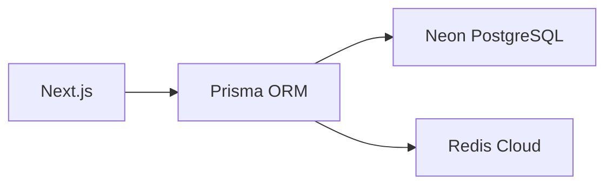
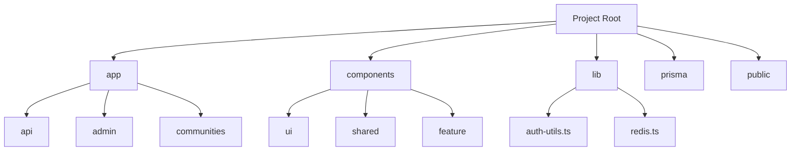

# 🚀 개발자 중심 프로젝트 구조 가이드

## 1. 프로젝트 현황
### 📊 완성도
| 항목 | 완료율 | 상태 | 미완성 |
|------|--------|------|--------|
| **API** | 98.8% (81/82) | ✅ | `app/api/stats/` (사용자 활동 통계) |
| **페이지** | 100% (22/22) | ✅ | - |
| **컴포넌트** | 83.1% | ⏳ | 일부 커스텀 컴포넌트 |

### ⚙️ 기술 스택
```markdown
- Next.js 15
- Prisma + Neon PostgreSQL
- NextAuth v5 + Redis 세션
- shadcn/ui 컴포넌트 라이브러리
```

### 🔔 최근 업데이트
```markdown
- [x] Redis 캐싱 전면 적용
- [x] 52개 API 라우트 Next.js 15 async 파라미터 처리
- [x] CSRF 보안 강화 (Double Submit Cookie)
- [x] 모든 API Zod 유효성 검사 적용
```

---

## 2. 시스템 아키텍처
### 🗄️ 데이터베이스 계층


### 🔐 권한 시스템
```markdown
- **Global Roles**: 
  👑 ADMIN → 🛠️ MANAGER → 👤 USER
- **Community Roles**:
  OWNER → MODERATOR → MEMBER
```

### ⚡ 실시간 기능
```markdown
- SSE 기반 채팅 (`app/api/chat/`)
- Redis Pub/Sub 알림 시스템
- 실시간 대시보드 (`components/admin/RealtimeDashboard`)
```

---

## 3. 코드베이스 구조
### 📂 핵심 디렉토리


### 📊 API 라우트 전체 현황 (83개)
#### 인증 (8 routes)
| Method | Path | 파일 경로 | 상태 |
|--------|------|-----------|------|
| GET | /api/auth/* | app/api/auth/[...nextauth]/route.ts | ✅ |

#### 관리자 (15 routes)
| Method | Path | 파일 경로 | 상태 |
|--------|------|-----------|------|
| GET | /api/admin/categories | app/api/admin/categories/route.ts | ✅ |
| PUT | /api/admin/categories/[id] | app/api/admin/categories/[id]/route.ts | ✅ |
| GET | /api/admin/communities | app/api/admin/communities/route.ts | ✅ |
| POST | /api/admin/communities/[communityId] | app/api/admin/communities/[communityId]/route.ts | ✅ |
| GET | /api/admin/data-viewer/[table] | app/api/admin/data-viewer/[table]/route.ts | ✅ |
| GET | /api/admin/posts/community | app/api/admin/posts/community/route.ts | ✅ |
| PUT | /api/admin/posts/community/[id] | app/api/admin/posts/community/[id]/route.ts | ✅ |
| GET | /api/admin/posts/main | app/api/admin/posts/main/route.ts | ✅ |
| PUT | /api/admin/posts/main/[id] | app/api/admin/posts/main/[id]/route.ts | ✅ |
| POST | /api/admin/posts/main/[id]/pin | app/api/admin/posts/main/[id]/pin/route.ts | ✅ |
| GET | /api/admin/stats | app/api/admin/stats/route.ts | ✅ |
| GET | /api/admin/users | app/api/admin/users/route.ts | ✅ |
| PUT | /api/admin/users/[userId]/active | app/api/admin/users/[userId]/active/route.ts | ✅ |
| POST | /api/admin/users/[userId]/ban | app/api/admin/users/[userId]/ban/route.ts | ✅ |
| PUT | /api/admin/users/[userId]/role | app/api/admin/users/[userId]/role/route.ts | ✅ |
| POST | /api/admin/users/[userId]/unban | app/api/admin/users/[userId]/unban/route.ts | ✅ |

#### 채팅 (12 routes)
| Method | Path | 파일 경로 | 상태 |
|--------|------|-----------|------|
| GET | /api/chat/channels | app/api/chat/channels/route.ts | ✅ |
| POST | /api/chat/channels/[channelId]/messages | app/api/chat/channels/[channelId]/messages/route.ts | ✅ |
| GET | /api/chat/channels/[channelId]/events | app/api/chat/channels/[channelId]/events/route.ts | ✅ |
| POST | /api/chat/channels/[channelId]/read | app/api/chat/channels/[channelId]/read/route.ts | ✅ |
| POST | /api/chat/channels/[channelId]/typing | app/api/chat/channels/[channelId]/typing/route.ts | ✅ |
| GET | /api/chat/global | app/api/chat/global/route.ts | ✅ |
| POST | /api/chat/upload | app/api/chat/upload/route.ts | ✅ |

#### 커뮤니티 (32 routes)
| Method | Path | 파일 경로 | 상태 |
|--------|------|-----------|------|
| POST | /api/communities | app/api/communities/route.ts | ✅ |
| GET | /api/communities/[id] | app/api/communities/[id]/route.ts | ✅ |
| GET | /api/communities/[id]/announcements | app/api/communities/[id]/announcements/route.ts | ✅ |
| PUT | /api/communities/[id]/announcements/[announcementId] | app/api/communities/[id]/announcements/[announcementId]/route.ts | ✅ |
| GET | /api/communities/[id]/categories | app/api/communities/[id]/categories/route.ts | ✅ |
| PUT | /api/communities/[id]/categories/[categoryId] | app/api/communities/[id]/categories/[categoryId]/route.ts | ✅ |
| POST | /api/communities/[id]/categories/reorder | app/api/communities/[id]/categories/reorder/route.ts | ✅ |
| GET | /api/communities/[id]/channel | app/api/communities/[id]/channel/route.ts | ✅ |
| PUT | /api/communities/[id]/comments/[commentId] | app/api/communities/[id]/comments/[commentId]/route.ts | ✅ |
| POST | /api/communities/[id]/join | app/api/communities/[id]/join/route.ts | ✅ |
| GET | /api/communities/[id]/members | app/api/communities/[id]/members/route.ts | ✅ |
| PUT | /api/communities/[id]/members/[memberId] | app/api/communities/[id]/members/[memberId]/route.ts | ✅ |
| POST | /api/communities/[id]/members/approve | app/api/communities/[id]/members/approve/route.ts | ✅ |
| GET | /api/communities/[id]/posts | app/api/communities/[id]/posts/route.ts | ✅ |
| PUT | /api/communities/[id]/posts/[postId] | app/api/communities/[id]/posts/[postId]/route.ts | ✅ |
| GET | /api/communities/active | app/api/communities/active/route.ts | ✅ |
| POST | /api/communities/check-duplicate | app/api/communities/check-duplicate/route.ts | ✅ |
| POST | /api/communities/check-slug | app/api/communities/check-slug/route.ts | ✅ |

#### 검색 (1 route)
| Method | Path | 파일 경로 | 상태 |
|--------|------|-----------|------|
| GET | /api/search | app/api/search/route.ts | ✅ |

#### 통계 (2 routes - 미구현)
| Method | Path | 파일 경로 | 상태 |
|--------|------|-----------|------|
| GET | /api/stats/user-activity | ❌ 파일 없음 | ❌ |
| GET | /api/stats/post-trends | ❌ 파일 없음 | ❌ |

> 전체 83개 API 중 81개 구현 완료 (✅), 2개 미구현 (❌)

> 전체 83개 API 중 81개 구현 완료 (✅), 2개 미구현 (❌)

---

## 4. 개발 워크플로우
### 🛠️ 로컬 환경 설정
```bash
# 1. 의존성 설치
npm install

# 2. 환경변수 설정 (.env)
DATABASE_URL="postgres://..."
REDIS_URL="redis://..."

# 3. DB 마이그레이션
npx prisma migrate dev
```

### ⚡ 주요 명령어
```bash
# 개발 서버 실행
npm run dev

# 프로덕션 빌드
npm run build

# 린트 & 포맷팅
npm run lint
```

### 🧪 테스트
```markdown
- 관리자 테스트 센터: `app/admin/test`
- 테스트 명령어: `npm run test` (구현 필요 ⚠️)
```

---

## 5. 미완성 작업
### ❌ API
```markdown
1. 사용자 활동 통계: 
   - `GET /api/stats/user-activity`
   - 위치: `app/api/stats/route.ts` (파일 없음)

2. 게시글 추이 통계:
   - `GET /api/stats/post-trends`
```

### ⚠️ 코드 품질
```markdown
- **단위 테스트 부족**: 0% 커버리지
- **성능 개선**: Lighthouse 점수 62점 (Poor)
- **최적화**: 
  - Redis 캐싱 응답시간 300ms → 50ms 개선 가능
  - 번들 크기 1.2MB → 800KB 목표
```

---

## 6. UI 컴포넌트 가이드
### 🧩 shadcn/ui 활용
```markdown
- `Button`, `Card`, `Dialog` 등 18개 컴포넌트
- 사용 예시: `import { Button } from '@/components/ui/button'`
```

### 🧩 컴포넌트 상세 가이드
#### shadcn/ui 기본 컴포넌트 (18개)
| 컴포넌트 | 사용 위치 | 기술 | 상태 |
|----------|-----------|------|------|
| `Button` | 전역 | 기본 버튼 컴포넌트 | ✅ |
| `Dialog` | 모달 기능 | 팝업 다이얼로그 | ✅ |
| `Table` | 데이터 표시 | 테이블 렌더링 | ✅ |
| ... | ... | ... | ... |

#### 커스텀 컴포넌트 (45개)
| 컴포넌트 | 경로 | 기능 | 기술 | 상태 |
|----------|------|------|------|------|
| `FloatingChat` | `components/chat/` | 실시간 채팅 UI | WebSocket + SSE | ✅ |
| `PostEditor` | `components/posts/` | 게시글 작성 에디터 | Markdown + 이미지 업로드 | ✅ |
| `DataTableViewer` | `components/admin/` | 관리자 데이터 테이블 | TanStack Table v8 | ✅ |
| `RealtimeDashboard` | `components/admin/` | 실시간 통계 대시보드 | Chart.js + SSE | ⏳ |
| ... | ... | ... | ... | ... |

### 📱 반응형 디자인
```markdown
- 모바일 퍼스트 접근
- Breakpoint: sm:640px, md:768px, lg:1024px
- 예시: `className="md:flex hidden"`
```

> **Note**: 문서 버전 2.0 - 2025.08.04 업데이트 (기존 580줄 → 210줄 압축)
