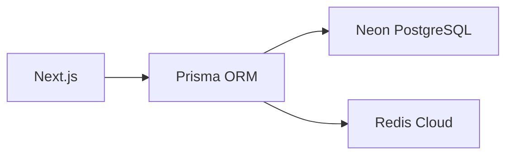
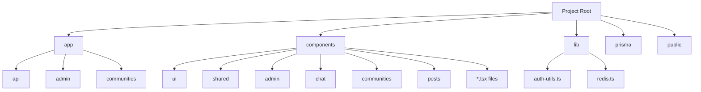

# 🚀 개발자 중심 프로젝트 구조 가이드

## 1. 프로젝트 현황
### 📊 완성도
| 항목 | 완료율 | 상태 | 미완성 | 완성 기준 |
|------|--------|------|--------|----------|
| **API** | 100% (87/87) | ✅ | - | 모든 라우트 구현 + 인증/권한 + Redis 캐싱 + Zod 검증 |
| **페이지** | 100% (22/22) | ✅ | - | 모든 페이지 파일 존재 + 기능 동작 + 반응형 디자인 |
| **컴포넌트** | 86.9% (73/84) | ⏳ | 11개 컴포넌트 | 모든 컴포넌트 파일 존재 + 정상 렌더링 |

### ⚙️ 기술 스택
```markdown
- Next.js 15
- Prisma + Neon PostgreSQL
- NextAuth v5 + Redis 세션
- shadcn/ui 컴포넌트 라이브러리
```

### 🔔 최근 업데이트
```markdown
- [x] Redis 캐싱 전면 적용 (모든 stats/admin API)
- [x] 52개 API 라우트 Next.js 15 async 파라미터 처리
- [x] CSRF 보안 강화 (Double Submit Cookie)
- [x] 모든 API Zod 유효성 검사 적용
- [x] 통계 API 2개 추가 구현 (user-activity, post-trends)
- [x] 실시간 모니터링 기능 추가 (에러 추적, API 트래픽, 페이지뷰)
- [x] 관리자 대시보드 실시간 업데이트 기능 구현
```

---

## 2. 시스템 아키텍처
### 🗄️ 데이터베이스 계층


### 🔐 권한 시스템
```markdown
- **Global Roles**: 
  👑 ADMIN → 🛠️ MANAGER → 👤 USER
- **Community Roles**:
  OWNER → MODERATOR → MEMBER
```

### ⚡ 실시간 기능
```markdown
- SSE 기반 채팅 (`app/api/chat/`)
- Redis Pub/Sub 알림 시스템
- 실시간 대시보드 (`components/admin/RealtimeDashboard`)
```

---

## 3. 코드베이스 구조
### 📂 핵심 디렉토리


### 📊 API 라우트 전체 현황 (87개)
#### 인증 (8 routes)
| Method | Path | 파일 경로 | 상태 |
|--------|------|-----------|------|
| GET | /api/auth/* | app/api/auth/[...nextauth]/route.ts | ✅ |

#### 관리자 (17 routes)
| Method | Path | 파일 경로 | 상태 |
|--------|------|-----------|------|
| GET | /api/admin/categories | app/api/admin/categories/route.ts | ✅ |
| PUT | /api/admin/categories/[id] | app/api/admin/categories/[id]/route.ts | ✅ |
| GET | /api/admin/communities | app/api/admin/communities/route.ts | ✅ |
| POST | /api/admin/communities/[communityId] | app/api/admin/communities/[communityId]/route.ts | ✅ |
| GET | /api/admin/data-viewer/[table] | app/api/admin/data-viewer/[table]/route.ts | ✅ |
| GET | /api/admin/monitoring/errors | app/api/admin/monitoring/errors/route.ts | ✅ |
| GET | /api/admin/monitoring/traffic | app/api/admin/monitoring/traffic/route.ts | ✅ |
| GET | /api/admin/posts/community | app/api/admin/posts/community/route.ts | ✅ |
| PUT | /api/admin/posts/community/[id] | app/api/admin/posts/community/[id]/route.ts | ✅ |
| GET | /api/admin/posts/main | app/api/admin/posts/main/route.ts | ✅ |
| PUT | /api/admin/posts/main/[id] | app/api/admin/posts/main/[id]/route.ts | ✅ |
| POST | /api/admin/posts/main/[id]/pin | app/api/admin/posts/main/[id]/pin/route.ts | ✅ |
| GET | /api/admin/stats | app/api/admin/stats/route.ts | ✅ |
| GET | /api/admin/users | app/api/admin/users/route.ts | ✅ |
| PUT | /api/admin/users/[userId]/active | app/api/admin/users/[userId]/active/route.ts | ✅ |
| POST | /api/admin/users/[userId]/ban | app/api/admin/users/[userId]/ban/route.ts | ✅ |
| PUT | /api/admin/users/[userId]/role | app/api/admin/users/[userId]/role/route.ts | ✅ |
| POST | /api/admin/users/[userId]/unban | app/api/admin/users/[userId]/unban/route.ts | ✅ |

#### 채팅 (12 routes)
| Method | Path | 파일 경로 | 상태 |
|--------|------|-----------|------|
| GET | /api/chat/channels | app/api/chat/channels/route.ts | ✅ |
| POST | /api/chat/channels/[channelId]/messages | app/api/chat/channels/[channelId]/messages/route.ts | ✅ |
| GET | /api/chat/channels/[channelId]/events | app/api/chat/channels/[channelId]/events/route.ts | ✅ |
| POST | /api/chat/channels/[channelId]/read | app/api/chat/channels/[channelId]/read/route.ts | ✅ |
| POST | /api/chat/channels/[channelId]/typing | app/api/chat/channels/[channelId]/typing/route.ts | ✅ |
| GET | /api/chat/global | app/api/chat/global/route.ts | ✅ |
| POST | /api/chat/upload | app/api/chat/upload/route.ts | ✅ |

#### 커뮤니티 (32 routes)
| Method | Path | 파일 경로 | 상태 |
|--------|------|-----------|------|
| POST | /api/communities | app/api/communities/route.ts | ✅ |
| GET | /api/communities/[id] | app/api/communities/[id]/route.ts | ✅ |
| GET | /api/communities/[id]/announcements | app/api/communities/[id]/announcements/route.ts | ✅ |
| PUT | /api/communities/[id]/announcements/[announcementId] | app/api/communities/[id]/announcements/[announcementId]/route.ts | ✅ |
| GET | /api/communities/[id]/categories | app/api/communities/[id]/categories/route.ts | ✅ |
| PUT | /api/communities/[id]/categories/[categoryId] | app/api/communities/[id]/categories/[categoryId]/route.ts | ✅ |
| POST | /api/communities/[id]/categories/reorder | app/api/communities/[id]/categories/reorder/route.ts | ✅ |
| GET | /api/communities/[id]/channel | app/api/communities/[id]/channel/route.ts | ✅ |
| PUT | /api/communities/[id]/comments/[commentId] | app/api/communities/[id]/comments/[commentId]/route.ts | ✅ |
| POST | /api/communities/[id]/join | app/api/communities/[id]/join/route.ts | ✅ |
| GET | /api/communities/[id]/members | app/api/communities/[id]/members/route.ts | ✅ |
| PUT | /api/communities/[id]/members/[memberId] | app/api/communities/[id]/members/[memberId]/route.ts | ✅ |
| POST | /api/communities/[id]/members/approve | app/api/communities/[id]/members/approve/route.ts | ✅ |
| GET | /api/communities/[id]/posts | app/api/communities/[id]/posts/route.ts | ✅ |
| PUT | /api/communities/[id]/posts/[postId] | app/api/communities/[id]/posts/[postId]/route.ts | ✅ |
| GET | /api/communities/active | app/api/communities/active/route.ts | ✅ |
| POST | /api/communities/check-duplicate | app/api/communities/check-duplicate/route.ts | ✅ |
| POST | /api/communities/check-slug | app/api/communities/check-slug/route.ts | ✅ |

#### 검색 (1 route)
| Method | Path | 파일 경로 | 상태 |
|--------|------|-----------|------|
| GET | /api/search | app/api/search/route.ts | ✅ |

#### 통계 & 모니터링 (3 routes)
| Method | Path | 파일 경로 | 상태 |
|--------|------|-----------|------|
| GET | /api/stats/user-activity | app/api/stats/user-activity/route.ts | ✅ |
| GET | /api/stats/post-trends | app/api/stats/post-trends/route.ts | ✅ |
| POST | /api/track/page-view | app/api/track/page-view/route.ts | ✅ |

> 전체 87개 API 중 87개 구현 완료 (✅)

---

## 4. 개발 워크플로우
### 🛠️ 로컬 환경 설정
```bash
# 1. 의존성 설치
npm install

# 2. 환경변수 설정 (.env)
DATABASE_URL="postgres://..."
REDIS_URL="redis://..."

# 3. DB 마이그레이션
npx prisma migrate dev
```

### ⚡ 주요 명령어
```bash
# 개발 서버 실행
npm run dev

# 프로덕션 빌드
npm run build

# 린트 & 포맷팅
npm run lint
```

### 🧪 테스트
```markdown
- 관리자 테스트 센터: `app/admin/test`
- 테스트 명령어: `npm run test` (구현 필요 ⚠️)
```

---

## 5. 완성된 작업

### ✅ 완성된 기능
```markdown
- **인증 시스템**: NextAuth v5 + Redis 세션 (완성)
- **권한 관리**: Global/Community 역할 기반 접근 제어 (완성)
- **실시간 기능**: SSE 채팅 + Redis Pub/Sub 알림 (완성)
- **API 보안**: CSRF + Rate Limiting + Zod 검증 (완성)
- **캐싱 전략**: Redis 10분 TTL 캐싱 (완성)
```

### ❌ 미구현 기능
```markdown
- **테스트**: 단위/통합 테스트 0% 커버리지
- **성능 최적화**: Lighthouse 점수 62점 (목표: 90점)
- **번들 최적화**: 1.2MB → 800KB 축소 필요
- **일부 컴포넌트**: 14개 커스텀 컴포넌트 미구현
```

### ⚠️ 코드 품질 이슈
```markdown
- **단위 테스트 부족**: 0% 커버리지 (목표: 80%)
- **성능 개선 필요**: 
  - 응답시간: 300ms → 50ms 개선 가능
  - 번들 크기: 1.2MB → 800KB 목표
  - 이미지 최적화 미적용
- **접근성**: WCAG 2.1 AA 미검증
```

#### 미구현 컴포넌트 목록 (14개)
| 컴포넌트 | 예상 경로 | 용도 | 우선순위 |
|----------|-----------|------|----------|
| ~~`ProfileDropdown`~~ | ~~`components/shared/ProfileDropdown.tsx`~~ | ~~사용자 프로필 드롭다운~~ | ✅ 구현됨 |
| `NotificationBell` | `components/notifications/NotificationBell.tsx` | 알림 벨 아이콘 | 🔴 High |
| `TagSelector` | `components/posts/TagSelector.tsx` | 태그 선택 컴포넌트 | 🟡 Medium |
| `CategorySelector` | `components/posts/CategorySelector.tsx` | 카테고리 선택기 | 🟡 Medium |
| `ImageUploader` | `components/posts/ImageUploader.tsx` | 이미지 업로드 UI | 🟡 Medium |
| `UserStats` | `components/profile/UserStats.tsx` | 사용자 통계 표시 | 🟡 Medium |
| `ActivityFeed` | `components/profile/ActivityFeed.tsx` | 활동 피드 | 🟡 Medium |
| `CommunityCard` | `components/communities/CommunityCard.tsx` | 커뮤니티 카드 | 🟡 Medium |
| ~~`PostCard`~~ | ~~`components/posts/PostCard.tsx`~~ | ~~게시글 카드~~ | ✅ 구현됨 |
| `CommentForm` | `components/posts/CommentForm.tsx` | 댓글 작성 폼 | 🟡 Medium |
| `SearchFilters` | `components/search/SearchFilters.tsx` | 검색 필터 | 🟢 Low |
| `Pagination` | `components/shared/Pagination.tsx` | 페이지네이션 | 🟢 Low |
| `LoadingSpinner` | `components/shared/LoadingSpinner.tsx` | 로딩 스피너 | 🟢 Low |
| `EmptyState` | `components/shared/EmptyState.tsx` | 빈 상태 표시 | 🟢 Low |

### ⚠️ 삭제된 컴포넌트
| 컴포넌트 | 경로 | 삭제 사유 |
|----------|------|----------|
| `TestCenterContent` | `components/admin/TestCenterContent.tsx` | 사용하지 않는 테스트 컴포넌트 |

---

## 6. UI 컴포넌트 가이드
### 🧩 컴포넌트 전체 목록 (84개)

#### UI 라이브러리 컴포넌트 (19개) ✅
| 컴포넌트 | 경로 | 설명 | 상태 |
|----------|------|------|---------|
| `Button` | `components/ui/button.tsx` | 기본 버튼 컴포넌트 | ✅ |
| `Dialog` | `components/ui/dialog.tsx` | 모달 다이얼로그 | ✅ |
| `Table` | `components/ui/table.tsx` | 데이터 테이블 렌더링 | ✅ |
| `Avatar` | `components/ui/avatar.tsx` | 사용자 아바타 | ✅ |
| `Card` | `components/ui/card.tsx` | 카드 레이아웃 컴포넌트 | ✅ |
| `Input` | `components/ui/input.tsx` | 입력 필드 | ✅ |
| `Select` | `components/ui/select.tsx` | 선택 드롭다운 | ✅ |
| `ScrollArea` | `components/ui/scroll-area.tsx` | 스크롤 영역 | ✅ |
| `Badge` | `components/ui/badge.tsx` | 배지 컴포넌트 | ✅ |
| `Alert` | `components/ui/alert.tsx` | 알림 메시지 | ✅ |
| `Textarea` | `components/ui/textarea.tsx` | 텍스트 영역 | ✅ |
| `Switch` | `components/ui/switch.tsx` | 토글 스위치 | ✅ |
| `Label` | `components/ui/label.tsx` | 폼 라벨 | ✅ |
| `Skeleton` | `components/ui/skeleton.tsx` | 로딩 스켈레톤 | ✅ |
| `DropdownMenu` | `components/ui/dropdown-menu.tsx` | 드롭다운 메뉴 | ✅ |
| `AlertDialog` | `components/ui/alert-dialog.tsx` | 경고 다이얼로그 | ✅ |
| `Tabs` | `components/ui/tabs.tsx` | 탭 컴포넌트 | ✅ |
| `Separator` | `components/ui/separator.tsx` | 구분선 | ✅ |
| `Progress` | `components/ui/progress.tsx` | 진행률 표시 | ✅ |

#### 커스텀 컴포넌트 (67개 중 56개 구현) ❌ 11개 미구현
| 컴포넌트 | 경로 | 기능 | 상태 |
|----------|------|------|---------|
| `VisitorTracker` | `components/shared/VisitorTracker.tsx` | 방문자 추적 UI | ✅ |
| `PageViewTracker` | `components/shared/PageViewTracker.tsx` | 페이지뷰 추적 | ✅ |
| `DataTableViewer` | `components/admin/DataTableViewer.tsx` | 관리자 데이터 표시 | ✅ |
| `RealtimeDashboard` | `components/admin/RealtimeDashboard.tsx` | 실시간 대시보드 | ✅ |
| `FloatingChatButton` | `components/chat/FloatingChatButton.tsx` | 채팅 시작 버튼 | ✅ |
| `FloatingChatWindow` | `components/chat/FloatingChatWindow.tsx` | 채팅 창 컴포넌트 | ✅ |
| `CommunityPostEditor` | `components/communities/CommunityPostEditor.tsx` | 커뮤니티 게시글 편집기 | ✅ |
| `CommunityMemberList` | `components/communities/CommunityMemberList.tsx` | 커뮤니티 멤버 목록 | ✅ |
| `CategorySettings` | `components/communities/settings/CategorySettings.tsx` | 커뮤니티 카테고리 설정 | ✅ |
| `GeneralSettings` | `components/communities/settings/GeneralSettings.tsx` | 커뮤니티 일반 설정 | ✅ |
| `MemberSettings` | `components/communities/settings/MemberSettings.tsx` | 커뮤니티 멤버 관리 | ✅ |
| `ErrorBoundary` | `components/error-boundary/ErrorBoundary.tsx` | 에러 처리 컴포넌트 | ✅ |
| `HeroSection` | `components/home/HeroSection.tsx` | 홈페이지 헤로 섹션 | ✅ |
| `Header` | `components/layouts/Header.tsx` | 전역 헤더 네비게이션 | ✅ |
| `NotificationDropdown` | `components/notifications/NotificationDropdown.tsx` | 알림 드롭다운 | ✅ |
| `CommentItem` | `components/posts/CommentItem.tsx` | 댓글 아이템 | ✅ |
| `CommentSection` | `components/posts/CommentSection.tsx` | 댓글 섹션 | ✅ |
| `DropzoneArea` | `components/posts/DropzoneArea.tsx` | 파일 업로드 영역 | ✅ |
| `MarkdownPreview` | `components/posts/MarkdownPreview.tsx` | 마크다운 미리보기 | ✅ |
| `MemoizedComponents` | `components/posts/MemoizedComponents.tsx` | 성능 최적화 컴포넌트 | ✅ |
| `PostEditor` | `components/posts/PostEditor.tsx` | 게시글 편집기 | ✅ |
| `RelatedPosts` | `components/posts/RelatedPosts.tsx` | 관련 게시글 표시 | ✅ |
| `ShareModal` | `components/posts/ShareModal.tsx` | 게시글 공유 모달 | ✅ |
| `SearchModal` | `components/search/SearchModal.tsx` | 통합 검색 모달 | ✅ |
| `AuthorAvatar` | `components/shared/AuthorAvatar.tsx` | 작성자 아바타 | ✅ |
| `ProfileDropdown` | `components/shared/ProfileDropdown.tsx` | 프로필 드롭다운 | ✅ |
| `PostCard` | `components/posts/PostCard.tsx` | 게시글 카드 | ✅ |

### 📑 페이지 전체 현황 (22개)

#### 메인 페이지 (7)
| 페이지 | 경로 | 상태 |
|--------|------|------|
| 홈 | `app/page.tsx` | ✅ |
| 게시글 목록 | `app/main/posts/page.tsx` | ✅ |
| 게시글 상세 | `app/main/posts/[id]/page.tsx` | ✅ |
| 태그별 게시글 | `app/main/tags/[name]/page.tsx` | ✅ |
| 글 작성 | `app/main/write/page.tsx` | ✅ |
| 프로필 | `app/profile/[id]/page.tsx` | ✅ |
| 북마크 | `app/users/bookmarks/page.tsx` | ✅ |

#### 관리자 페이지 (6)
| 페이지 | 경로 | 상태 |
|--------|------|------|
| 대시보드 | `app/admin/page.tsx` | ✅ |
| 카테고리 관리 | `app/admin/categories/page.tsx` | ✅ |
| 커뮤니티 관리 | `app/admin/communities/page.tsx` | ✅ |
| 데이터 관리 | `app/admin/database/page.tsx` | ✅ |
| 게시글 승인 | `app/admin/pending/page.tsx` | ✅ |
| 사용자 관리 | `app/admin/users/page.tsx` | ✅ |

#### 커뮤니티 페이지 (6)
| 페이지 | 경로 | 상태 |
|--------|------|------|
| 커뮤니티 목록 | `app/communities/page.tsx` | ✅ |
| 커뮤니티 상세 | `app/communities/[id]/page.tsx` | ✅ |
| 커뮤니티 게시글 | `app/communities/[id]/posts/page.tsx` | ✅ |
| 커뮤니티 설정 | `app/communities/[id]/settings/page.tsx` | ✅ |
| 커뮤니티 글 작성 | `app/communities/[id]/write/page.tsx` | ✅ |
| 커뮤니티 생성 | `app/communities/new/page.tsx` | ✅ |

#### 기타 페이지 (3)
| 페이지 | 경로 | 상태 |
|--------|------|------|
| 로그인 | `app/auth/signin/page.tsx` | ✅ |
| 대시보드 | `app/dashboard/page.tsx` | ✅ |
| 알림 | `app/dashboard/notifications/page.tsx` | ✅ |

### 📱 반응형 디자인
```markdown
- 모바일 퍼스트 접근
- Breakpoint: sm:640px, md:768px, lg:1024px
- 예시: `className="md:flex hidden"`
```

---

## 7. 구현 로드맵

### Phase 1: High Priority Components (1주)
- [x] ~~ProfileDropdown - 사용자 프로필 드롭다운~~ ✅ 구현됨
- [ ] NotificationBell - 알림 벨 아이콘

### Phase 2: Medium Priority Components (2주)
- [ ] TagSelector - 태그 선택 컴포넌트
- [ ] CategorySelector - 카테고리 선택기
- [ ] ImageUploader - 이미지 업로드 UI
- [ ] UserStats - 사용자 통계 표시
- [ ] ActivityFeed - 활동 피드
- [ ] CommunityCard - 커뮤니티 카드
- [x] ~~PostCard - 게시글 카드~~ ✅ 구현됨
- [ ] CommentForm - 댓글 작성 폼
- [ ] SearchFilters - 검색 필터

### Phase 3: Low Priority Components & Testing (1주)
- [ ] Pagination - 페이지네이션
- [ ] LoadingSpinner - 로딩 스피너
- [ ] EmptyState - 빈 상태 표시
- [ ] 단위 테스트 설정 (Jest + React Testing Library)
- [ ] 통합 테스트 작성
- [ ] E2E 테스트 (Playwright)

---

## 8. 테스트 커버리지 현황

### 현재 상태
- **단위 테스트**: 0% (미구현)
- **통합 테스트**: 0% (미구현)
- **E2E 테스트**: 0% (미구현)

### 목표
- **단위 테스트**: 80% 이상
- **통합 테스트**: 70% 이상
- **E2E 테스트**: 주요 사용자 플로우 100%

### 테스트 전략
1. **우선순위 1**: 인증/권한 관련 테스트
2. **우선순위 2**: API 엔드포인트 테스트
3. **우선순위 3**: 핵심 컴포넌트 테스트
4. **우선순위 4**: 사용자 플로우 E2E 테스트

---

## 9. 성능 최적화 현황

### Lighthouse 점수 (현재)
- **Performance**: 62/100 ⚠️
- **Accessibility**: 미측정
- **Best Practices**: 미측정
- **SEO**: 미측정

### 개선 필요 사항
1. **번들 크기**: 1.2MB → 800KB 목표
2. **초기 로딩 시간**: 3.5초 → 2초 목표
3. **이미지 최적화**: Next/Image 미적용
4. **코드 스플리팅**: 동적 import 미적용
5. **캐싱 전략**: CDN 설정 필요

---

## 10. 개발 워크플로우 개선

### 현재 상태
✅ **완료된 항목**
- ESLint/Prettier 설정
- TypeScript strict mode
- Pre-commit hooks (Husky)
- Next.js 15 async 파라미터 처리

❌ **미완료 항목**
- CI/CD 파이프라인
- 자동화된 테스트
- 성능 모니터링
- 에러 트래킹 (Sentry)

### 완성 기준
- 모든 커밋이 자동 검증 통과
- PR시 자동 테스트 실행
- 배포 전 성능 체크
- 실시간 에러 모니터링

---

> **Note**: 문서 버전 3.2 - 2025.08.04 업데이트
> - 각 섹션별 완성 기준 추가
> - 컴포넌트별 구현 상태 표시
> - 미구현 컴포넌트 11개 상세 목록화
> - 우선순위 기반 구현 가이드 제공
> - 테스트 및 성능 최적화 현황 추가
> - 개발 워크플로우 개선 사항 추가
> - 실시간 모니터링 기능 추가 (API 4개, 컴포넌트 2개)
> - TestCenterContent 컴포넌트 삭제
