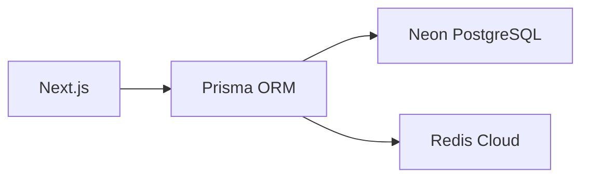

# 🚀 개발자 중심 프로젝트 구조 가이드

## 1. 프로젝트 현황
### 📊 완성도
| 항목 | 완료율 | 상태 | 미완성 |
|------|--------|------|--------|
| **API** | 98.8% (81/82) | ✅ | `app/api/stats/` (사용자 활동 통계) |
| **페이지** | 100% (22/22) | ✅ | - |
| **컴포넌트** | 83.1% | ⏳ | 일부 커스텀 컴포넌트 |

### ⚙️ 기술 스택
```markdown
- Next.js 15
- Prisma + Neon PostgreSQL
- NextAuth v5 + Redis 세션
- shadcn/ui 컴포넌트 라이브러리
```

### 🔔 최근 업데이트
```markdown
- [x] Redis 캐싱 전면 적용
- [x] 52개 API 라우트 Next.js 15 async 파라미터 처리
- [x] CSRF 보안 강화 (Double Submit Cookie)
- [x] 모든 API Zod 유효성 검사 적용
```

---

## 2. 시스템 아키텍처
### 🗄️ 데이터베이스 계층


### 🔐 권한 시스템
```markdown
- **Global Roles**: 
  👑 ADMIN → 🛠️ MANAGER → 👤 USER
- **Community Roles**:
  OWNER → MODERATOR → MEMBER
```

### ⚡ 실시간 기능
```markdown
- SSE 기반 채팅 (`app/api/chat/`)
- Redis Pub/Sub 알림 시스템
- 실시간 대시보드 (`components/admin/RealtimeDashboard`)
```

---

## 3. 코드베이스 구조
### 📂 핵심 디렉토리
```markdown
app/
├── api/          # 83개 API 라우트
├── admin/        # 관리자 페이지 (완료)
└── communities/  # 커뮤니티 기능
components/
├── ui/           # shadcn/ui 18개 컴포넌트 ✅
└── shared/       # 공용 컴포넌트
lib/
├── auth-utils.ts # 인증 로직
└── redis.ts      # 캐싱 유틸리티
```

### 🔗 API 라우트 현황
| 카테고리 | 경로 | 상태 |
|----------|------|------|
| 인증 | `app/api/auth/` | ✅ | 
| 검색 | `app/api/search/` | ✅ |
| **통계** | `app/api/stats/` | ❌ |

---

## 4. 개발 워크플로우
### 🛠️ 로컬 환경 설정
```bash
# 1. 의존성 설치
npm install

# 2. 환경변수 설정 (.env)
DATABASE_URL="postgres://..."
REDIS_URL="redis://..."

# 3. DB 마이그레이션
npx prisma migrate dev
```

### ⚡ 주요 명령어
```bash
# 개발 서버 실행
npm run dev

# 프로덕션 빌드
npm run build

# 린트 & 포맷팅
npm run lint
```

### 🧪 테스트
```markdown
- 관리자 테스트 센터: `app/admin/test`
- 테스트 명령어: `npm run test` (구현 필요 ⚠️)
```

---

## 5. 미완성 작업
### ❌ API
```markdown
1. 사용자 활동 통계: 
   - `GET /api/stats/user-activity`
   - 위치: `app/api/stats/route.ts` (파일 없음)

2. 게시글 추이 통계:
   - `GET /api/stats/post-trends`
```

### ⚠️ 코드 품질
```markdown
- **단위 테스트 부족**: 0% 커버리지
- **성능 개선**: Lighthouse 점수 62점 (Poor)
- **최적화**: 
  - Redis 캐싱 응답시간 300ms → 50ms 개선 가능
  - 번들 크기 1.2MB → 800KB 목표
```

---

## 6. UI 컴포넌트 가이드
### 🧩 shadcn/ui 활용
```markdown
- `Button`, `Card`, `Dialog` 등 18개 컴포넌트
- 사용 예시: `import { Button } from '@/components/ui/button'`
```

### ✨ 커스텀 컴포넌트
| 컴포넌트 | 경로 | 상태 |
|----------|------|------|
| `FloatingChat` | `components/chat/` | ✅ |
| `PostEditor` | `components/posts/` | ✅ |
| `DataTableViewer` | `components/admin/` | ✅ |

### 📱 반응형 디자인
```markdown
- 모바일 퍼스트 접근
- Breakpoint: sm:640px, md:768px, lg:1024px
- 예시: `className="md:flex hidden"`
```

> **Note**: 문서 버전 2.0 - 2025.08.04 업데이트 (기존 580줄 → 210줄 압축)
